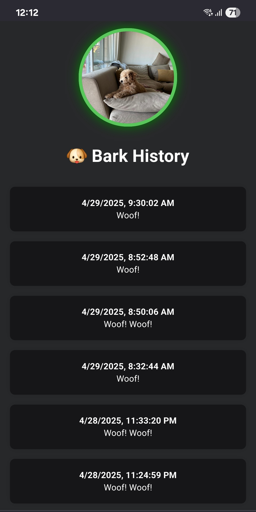
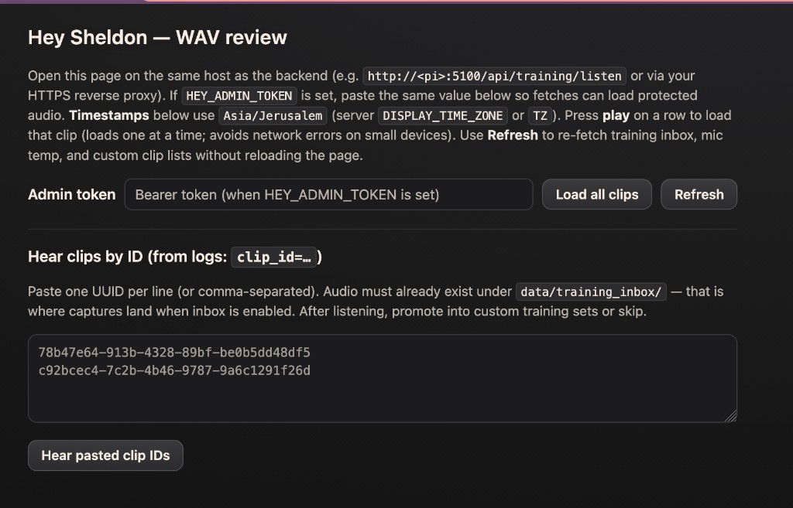

# Hey Sheldon

</br>
</br>

<p align="center">
  
</p>

<h4 align="center">
 AI bark detection for Raspberry Pi - know when your dog barks while you're away 🐶
</h4>

<p align="center">
  
  
  
  
  
  
  
  
  
</p>

<p align="center">
  
  
  
</p>

## Features

- 🧠 **AI Bark Detection** | Uses Google's YAMNet ML model to distinguish barks from other sounds.

- 🐶 **Smart Session Grouping** | Aggregates bark streaks.

- 🛠️ **Node.js Backend** | Express API + sound detection + Python ML sidecar.

- 🎨 **Vite + React 18 Frontend** | Optimized and served lightning-fast with Nginx over HTTPS.

- 🐕‍🦺 **Real-Time Bark History** | Displays live bark events with auto-refresh.

- 🗂️ **Lightweight SQLite Persistence** | Simple, reliable local storage of events.

- 🐳 **Fully Dockerized** | One command to deploy on a Raspberry Pi.

- 🔒 **HTTPS Everywhere**.

</br>

## Project Structure

```bash
Hey-Sheldon/
├── frontend/                    # Vite + React SPA served via Nginx
│   ├── src/                     # Source code
│   ├── nginx-ssl.conf.template  # HTTPS server skeleton → `/etc/nginx/templates/` (cert paths substituted at runtime)
│   ├── nginx-http-only.conf     # HTTP fallback → `/etc/nginx/templates/` (before certs exist)
│   ├── nginx-snippets/          # Root vs `PUBLIC_URL` prefix locations → `app-dynamic.conf` at container start
│   ├── security-headers.conf    # Shared browser security headers
│   ├── docker-entrypoint.sh     # Picks SSL or HTTP config at startup
│   └── Dockerfile               # Multi-stage: Node 22 (Vite build) → nginx:mainline-alpine-perl
├── backend/                     # Node.js sound detection + API
│   ├── server.js                # Express API + ML detection orchestration
│   ├── sound-detector.js        # sox mic recording → WAV clips
│   ├── classify_bark.py         # YAMNet TFLite inference + optional embedding head (Python sidecar)
│   ├── train_custom_head.py     # Train logistic head from labeled WAV clips (optional)
│   ├── training-inbox.js        # Copy classified clips for clip_id → promote workflow
│   ├── inbox-train.js           # CLI: promote inbox UUID → custom_clips + train (optional)
│   ├── bark-classifier.js       # Node.js ↔ Python pipe manager
│   ├── hey.js                   # Bark aggregation + DB writes
│   ├── db.js                    # SQLite setup
│   ├── config.json              # Detection thresholds
│   ├── data/custom_clips/       # bark/ + not_bark/ WAVs (runtime; ./backend/data bind mount)
│   ├── data/custom_model/       # Trained head.json (runtime; same bind mount)
│   ├── data/training_inbox/     # Recent clips (runtime; same bind mount)
│   ├── models/                  # YAMNet weights + class map (in repo; copied in Docker)
│   └── Dockerfile               # Node 22 + Python + COPY models from context
├── docker-compose.yml           # Orchestrates frontend, backend, certbot
├── deploy.sh                    # Build + tag + deploy script
└── README.md
```

## Setup

### Prerequisites

- Docker and Docker Compose
- Node.js 22+ for local development
- A USB microphone
- A Raspberry Pi 4 (recommended for deployment)

### Quick Start

- On mac

```shell
  brew install sox
```

See [Development](#development) for local frontend/backend.

- On Raspberry Pi

```shell
  cd Hey-Sheldon
  ./deploy.sh
```

- App URL: `https://domain/hey-x-sheldon/`
- Backend API: proxied through Nginx at `/hey-x-sheldon/api/messages`

## How It Works

| Component         | Tech                    | Description                                                     |
| ----------------- | ----------------------- | --------------------------------------------------------------- |
| **Frontend**      | Vite + React + Nginx    | Static SPA served over HTTPS with security headers              |
| **Backend**       | Node.js 22 + Express    | API server + sound detection orchestration                      |
| **ML Classifier** | Python + YAMNet TFLite  | Classifies audio clips into 521 categories (bark, speech, etc.) |
| **Database**      | SQLite                  | Local persistent storage (Docker named volume)                  |
| **TLS**           | Let's Encrypt + certbot | Auto-renewing HTTPS certificates                                |

### ML Detection Flow

1. `sox` records from the USB microphone, using silence detection to isolate sound events
2. Each sound event is saved as a 16 kHz mono WAV file
3. The server computes the clip’s **RMS** (volume). If it is below `MIN_RMS_AMPLITUDE` (noise floor), the clip is discarded and YAMNet is not run
4. Otherwise the WAV is sent to `classify_bark.py` (YAMNet TFLite) over a long-lived stdin/stdout sidecar
5. YAMNet returns confidence scores for 521 audio classes. If any bark-related class (Bark, Bow-wow, Dog, Growling, Howl, Whimper, Yip) scores above `BARK_CONFIDENCE_THRESHOLD` → that clip counts as a bark (**yamnet** branch).
6. **Optional:** If `CUSTOM_HEAD_ENABLED` is true and `data/custom_model/head.json` exists, the same forward pass also yields a **1024-D embedding**. A trained logistic **head** outputs a probability; the final decision is **either** YAMNet bark **or** custom head ≥ `CUSTOM_HEAD_THRESHOLD` (recall-oriented merge for sounds YAMNet mislabels).
7. After `DETECTION_THRESHOLD` consecutive bark clips, `hey` opens or extends a **grouped** event; `AGGREGATION_TIMER` sets the grouping window in seconds (default 60) before a new one can start

### Admin password

If your site is reachable from the internet, set a secret on the **backend** so random visitors cannot change detection settings or delete bark history via the API:

1. Pick a long random string (password manager or `openssl rand -hex 32`).
2. Pass it to the backend as `HEY_ADMIN_TOKEN`. Wired from your host environment (see `docker-compose.yml`).
3. Restart the backend container.

When the variable is **set**, mutating routes require header `Authorization: Bearer <exact same string>`
When it is **unset**, the server logs a warning and those routes stay open (convenient for local LAN dev).

**LAN docs bypass (optional):** If `HEY_DOCS_ADMIN_TRUST_LAN=true`, clients whose **direct TCP connection** is from a private IPv4 LAN address (RFC1918 / link-local APIPA) may open `/api/docs`, `GET /api/openapi.yaml`, and `PUT /api/custom-head/clip/:label` **without** a Bearer header. Requests forwarded by a reverse proxy (public TCP peer) still need `HEY_ADMIN_TOKEN`. Same socket rule as `HEY_REQUIRE_HTTPS_TRUST_LAN` — not based on `X-Forwarded-For`.

In the web UI, use the **lock** icon, enter the same value as `HEY_ADMIN_TOKEN` once per browser tab; it is kept in **session storage** until you close the tab. The dialog checks the token with `POST /api/auth/verify-admin` first — a wrong value shows an error and nothing is saved. Reads (`GET /api/config`, bark list, presence) stay unauthenticated so the dashboard still loads.

### Tuning

Use **Detection Settings** in the web app (gear icon) or edit `backend/config.json`.

| Key                               | Meaning                                                                                                                                                                                                                                                                             |
| --------------------------------- | ----------------------------------------------------------------------------------------------------------------------------------------------------------------------------------------------------------------------------------------------------------------------------------- |
| `BARK_CONFIDENCE_THRESHOLD`       | 0–1, minimum YAMNet confidence for a bark (default **0.25**). **any** (≈0%) to **certain** (100%) in the UI.                                                                                                                                                                        |
| `MIN_RMS_AMPLITUDE`               | 0–1, minimum RMS of the WAV for the clip to be classified; higher = stricter (default **0.30**).                                                                                                                                                                                    |
| `AI_DETECTION_ENABLED`            | If `false`, volume-only mode (no YAMNet).                                                                                                                                                                                                                                           |
| `DETECTION_THRESHOLD`             | How many consecutive barks in a row before the app records/sends a grouped event (default **1**).                                                                                                                                                                                   |
| `AGGREGATION_TIMER`               | How long a grouped bark “session” stays open; also used in the web UI to decide when the last RMS sample is “recent” for the status ring (seconds, default 60, range 10–300).                                                                                                       |
| `MIC_MUTED`                       | If `true`, the microphone is off: **no** recording, **no** WAV files, **no** calls to the Python classifier. Default `false`. Changing it applies immediately and is persisted in `config.json`.                                                                                    |
| `HEY_ADMIN_TOKEN` / `ADMIN_TOKEN` | **Backend env only**. SPA lock, Swagger/OpenAPI, messages/config/logs, clip upload, training WAV API, and `POST /api/custom-head/train`. |
| `HEY_DOCS_ADMIN_TRUST_LAN` | Optional. If `true`, direct private-LAN TCP clients may use Swagger/OpenAPI and docs-gated clip upload without Bearer (see **LAN docs bypass** above). |
| `CUSTOM_HEAD_ENABLED`             | If `true` **and** `backend/data/custom_model/head.json` exists, apply the trained embedding head. Default `false`.                                                                                                                                                                  |
| `CUSTOM_HEAD_THRESHOLD`           | 0–1, probability threshold for the custom head (default **0.55**). Final bark if YAMNet says bark **or** custom probability ≥ this value.                                                                                                                                           |
| `TRAINING_INBOX_ENABLED`          | If `true` (default), each classified event copies the WAV + metadata to `data/training_inbox/` and logs `clip_id=<UUID>` so you can promote it into training sets later. Set `false` on storage-constrained hosts if you only upload clips manually.                                |
| `TRAINING_INBOX_MAX_FILES`        | Ring buffer size for the inbox (default **80**, range **10–500**); oldest clips are deleted first.                                                                                                                                                                                  |

Backend logs show what YAMNet classifies each sound as (with optional custom-head fields when enabled):

```
4/24/2026 | classified: Bark (0.78) bark_score=0.78 yamnet_is_bark=true is_bark=true | top5: ... clip_id=a1b2c3d4-...
4/24/2026 | classified: Speech (0.65) bark_score=0.02 yamnet_is_bark=false is_bark=true custom_head=0.62 | top5: ... clip_id=e5f6...
```

If classification fails for a clip (bad WAV, tensor error), the line includes `error=…` and `top5` may be empty — check `docker logs hey-sheldon-backend` for `[bark-classifier]` stderr.

### Promote & Custom embedding head (training)

YAMNet is fixed on generic AudioSet labels; your dog’s vocalizations may map to “Speech”, “Heart sounds”, etc. The optional **second stage** learns from **your** labeled WAVs.

#### From log line to trained head (inbox)

When `TRAINING_INBOX_ENABLED=true`, each classified sound gets a `clip_id` and lands in `data/training_inbox/`.

1. Copy a `clip_id` from logs or `GET /api/presence`.
2. Promote it to `bark` or `not_bark`:

- Browser UI: `http://<host>:5100/api/training/listen` (paste admin token there if `HEY_ADMIN_TOKEN` is set).

  

```bash
curl -H "Authorization: Bearer $TOKEN" -X POST "https://your-host/hey-x-sheldon/api/training/inbox/$CLIP_ID/promote" \
  -H "Content-Type: application/json" -d '{"label":"bark"}'
```

**CLI:** `npm run inbox-train -- <uuid> bark|not_bark` — promote + train (see [Development](#development)).

```bash
cd backend
npm run inbox-train -- <clip-uuid> bark
npm run inbox-train -- <clip-uuid> not_bark

# Same thing without npm:
node inbox-train.js <clip-uuid> bark

# Only promote (copy WAV); skip Python training
node inbox-train.js <clip-uuid> bark --promote-only

node inbox-train.js --help
```

On a Pi with Docker, run it **inside** the backend container so paths match the volume:

```bash
docker compose exec backend npm run inbox-train -- YOUR-UUID-HERE bark
```

1. Train the custom head (if promote-only path was used):

- Swagger docs: `http://<host>:5100/api/docs/` → run `POST /api/custom-head/train`.
- CLI: `cd backend && npm run train-head`.

All paths use the same underlying training script (`train_custom_head.py`); only the trigger method changes.

**Behind the scenes (disk):**

- promoted clips are saved to `backend/data/custom_clips/bark/` or `backend/data/custom_clips/not_bark/`
- training writes `backend/data/custom_model/head.json`
- with Docker Compose, these persist on host under `./backend/data/`

**HTTP API (mutating routes follow the same admin Bearer rules as `/api/config`):**

| Method   | Path                                  | Purpose                                                                                   |
| -------- | ------------------------------------- | ----------------------------------------------------------------------------------------- |
| `GET`    | `/api/custom-head/status`             | Clip counts, whether `head.json` exists, last training metadata                           |
| `POST`   | `/api/custom-head/train`              | Runs `train_custom_head.py` on the server                                                 |
| `PUT`    | `/api/custom-head/clip/:label`        | Upload raw WAV body; `label` is `bark` or `not_bark` (max 4 MB)                           |
| `GET`    | `/api/training/inbox`                 | List inbox clips (metadata + sizes); includes `inboxEnabled` / `maxFiles`                 |
| `GET`    | `/api/training/inbox/:clipId/audio`   | Stream the WAV                                                                            |
| `POST`   | `/api/training/inbox/:clipId/promote` | Body `{ "label": "bark" }` or `{ "label": "not_bark" }` — copies WAV into `custom_clips/` |
| `DELETE` | `/api/training/inbox/:clipId`         | Remove inbox WAV + JSON                                                                   |

**Presence / UI:** `GET /api/presence` includes `lastClassified` fields such as `yamnetIsBark`, `customHeadScore`, `customHeadUsed`, and `clipId` (when the inbox is enabled) when applicable.

### Why Python from Node.js?

The ML classifier runs as a **long-lived Python sidecar process** spawned by Node.js at startup. They communicate via stdin/stdout (zero network overhead). This is the recommended approach for ML on a Raspberry Pi because:

- `tflite-runtime` (Python) is officially supported and well-tested on ARM64
- `@tensorflow/tfjs-node` (Node.js) is fragile to compile on Alpine/ARM
- A separate HTTP microservice would waste resources on a single Pi
- The stdin/stdout pipe adds <1 ms of latency per classification

### Docker backend notes

- The backend service mounts a small `tmpfs` on `/tmp` for general system temporaries. Mic WAV clips write to `data/mic_temp/` (bind-mounted) instead of tmpfs so they survive container restarts and can be moved to training inbox.
- **Settings JSON:** Compose sets `HEY_CONFIG_PATH=/app/backend/data/config.json` so config lives **inside** the same `./backend/data` bind mount as SQLite (one mount for persisted state). On first boot, if that file is missing, the server **copies** the image template from `config.json`. Edit `backend/data/config.json` on the host when needed, or use the app’s Detection Settings; keep it **valid JSON**. **Non-Docker** local runs still use `backend/config.json` in the repo by default.
- **SQLite + training data:** `./backend/data` is bind-mounted to `/app/backend/data`(database,`config.json`when using Docker,`custom_clips/`, `custom_model/head.json`, `training_inbox/`, `mic_temp/`). Back up that folder for a full snapshot. If you still have an old `hey-db` named volume from a previous compose file, copy its contents into `./backend/data` once, then `docker volume rm` the unused volume.

### Docker frontend (nginx + TLS)

DNS and TLS paths are **not** hardcoded in the image. Set them in `.env` (same folder as `docker-compose.yml`):

| Variable         | Purpose                                                                                                                                                                                                                             |
| ---------------- | ----------------------------------------------------------------------------------------------------------------------------------------------------------------------------------------------------------------------------------- |
| `PRIMARY_DOMAIN` | Nginx: `server_name` and cert paths. Backend: CORS. **Frontend build:** `VITE_PRIMARY_DOMAIN` (see `frontend/src/config.js`). HTTPS mode when cert exists.                                                                          |
| `PUBLIC_URL`     | Path under `/usr/share/nginx/html` where the build is installed (`docker-compose.yml` defaults to `/`). Must be **identical** at **image build time** and **container runtime** — passed as a **build arg** and as **environment**. |

**After pulling changes**, rebuild the frontend image so the bundle and nginx paths stay aligned:

```bash
docker compose build --no-cache frontend && docker compose up -d
```

**App URL shape:** With default `PUBLIC_URL=/`, use `https://your-domain/`. For a subpath, set `PUBLIC_URL` in `.env` and rebuild the frontend so the bundle matches.

Build copies nginx pieces into `/etc/nginx/templates/` in the image; at startup, `docker-entrypoint.sh` writes the active configs:

| Repo path                                                                                          | Role inside the container                                                                                                                                                                        |
| -------------------------------------------------------------------------------------------------- | ------------------------------------------------------------------------------------------------------------------------------------------------------------------------------------------------ |
| `frontend/nginx-ssl.conf.template`                                                                 | `/etc/nginx/conf.d/default.conf` when `PRIMARY_DOMAIN` is set and `/etc/letsencrypt/live/$PRIMARY_DOMAIN/fullchain.pem` exists. `@PRIMARY_DOMAIN@` and `@SSL_SERVER_NAMES@` substituted (`sed`). |
| `frontend/nginx-http-only.conf`                                                                    | `default.conf` when that cert is missing (HTTP on 80 only).                                                                                                                                      |
| `frontend/nginx-snippets/app-locations-root.conf.template` or `app-locations-prefix.conf.template` | `/etc/nginx/snippets/app-dynamic.conf` — root template copied as-is at `/`; otherwise `%%PUBLIC_URL%%` in the prefix template is replaced.                                                       |

`PUBLIC_URL` must match the Vite/React build (same directory under `/usr/share/nginx/html`). Example subpath deploy:

```bash
docker compose build --build-arg PUBLIC_URL=/hey-x-${DOG_SLUG} frontend
```

Set the same value in `.env` at runtime (e.g. `PUBLIC_URL=/hey-x-${DOG_SLUG}`).

**Ports:** Compose publishes **8443:443** only (HTTPS from the host). **8080:80** is not mapped — use HTTPS URLs. Before TLS certs exist, uncomment or add `8080:80` under `frontend.ports` so nginx HTTP-only mode is reachable for debugging.

### SSL Certificate Setup

On the Raspberry Pi, obtain certificates **before** the first HTTPS deploy:

```bash
docker run --rm \
  -p 8080:80 \
  -v /etc/letsencrypt:/etc/letsencrypt \
  -v /var/lib/letsencrypt:/var/lib/letsencrypt \
  certbot/certbot certonly --standalone \
  -d domain.uk -d www.domain.uk \
  --agree-tos --email your@gmail.com
```

## Development

### Frontend-only UI demo

Run the React UI and a Vite-hosted in-memory demo API without starting the backend:

```bash
cd frontend
nvm use 24
npm run start:demo
```

Open `http://localhost:5173`. Demo mode pre-authenticates the main tab and provides
messages, presence, settings, backend logs, and the training review page. The
development-only `HEY_ADMIN_TOKEN` for manually testing login is:

```text
hey-demo-admin
```

Demo mutations last until the Vite process restarts. This token is not read from
the repository root `.env` and must not be used in production.

**Frontend:**

```bash
cd frontend
# rm -rf node_modules
# npm cache clean --force
# npm rebuild
npm install
npm start
```

**Backend:**

```bash
cd backend
npm install
npm start
```

Python dependencies for local ML:

```bash
pip3 install ai-edge-litert numpy
```

To train the optional embedding head locally (after placing WAVs under `data/custom_clips/bark/` and `not_bark/`):

```bash
cd backend && npm run train-head
```

## Tests

**Backend** — integration tests use **Jest** and **Supertest** (listed under `devDependencies` in `backend/package.json`):

```bash
cd backend && npm test
```

**Frontend** — run Jest once without watch mode (CI-friendly):

```bash
cd frontend && npm run test:ci
```

## Troubleshooting

- **Frontend crash-loops with "cannot load certificate"** — certs don’t exist yet. Run `certbot certonly` first, then restart the container.
- **YAMNet not classifying** — check `docker logs hey-sheldon-backend` for Python errors. Ensure `models/yamnet.tflite` exists inside the container.
- **False positives** — increase `BARK_CONFIDENCE_THRESHOLD` in `config.json` (e.g. `0.35`), or raise `MIN_RMS_AMPLITUDE` so only louder clips are classified.
- **Custom head ignored** — `CUSTOM_HEAD_ENABLED` must be `true` and `data/custom_model/head.json` must exist after training. Run `GET /api/custom-head/status/` or check the volume path inside the container. If training skips clips with “no embedding”, your`yamnet.tflite` export must expose both 521-way scores and 1024-D embeddings (standard TF Hub YAMNet Lite).
- **Custom head false positives** — raise `CUSTOM_HEAD_THRESHOLD`; add harder negatives under `custom_clips/not_bark/` and retrain.
- **No sound detected** — verify the USB mic is at `hw:1,0`: run `arecord -l` inside the container.
- `Couldn't read config.json` on startup — fix invalid JSON at the path in the log and restart. With Docker Compose, that file is usually `backend/data/config.json` on the host (see \*\*Docker backend notes above).
- Always **rebuild** after code changes:

```bash
docker compose down
docker compose up --build

docker compose logs -f
docker compose logs backend -f
```

## Future Improvements

- [x] **Integrate AI-Based Bark Detection** — YAMNet TFLite (521 audio classes)
- [x] **Optional personalized embedding head** — train `head.json` from labeled WAVs (`train_custom_head.py` + APIs)
- [x] **Frontend-Controlled Sensitivity Adjustment** — Change thresholds from the web app
- [ ] **Live Sound Monitoring Graph** — Real-time audio waveform on the frontend
- [ ] **Expanded Sound Analytics Dashboard** — Visualizations of detection trends
- [ ] **Real-Time Updates via WebSocket** — Push live detection events without page refresh

## License

---

This project is licensed under the [MIT License](LICENSE).

## ☕ 🍺 Support

If you enjoyed using **Hey Sheldon**, consider buying me a coffee / beer! 🐾

Your support helps keep this project barking! 🐶🚀
[Buy me a Coffee or a Beer ☕ 🍺](https://ko-fi.com/itai590)

---
